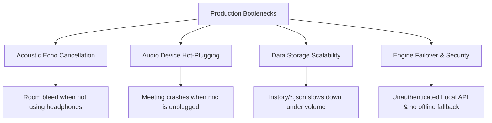

# Codebase Production-Readiness Analysis

An in-depth analysis of the current system architecture, identifying what is production-ready, what requires additional refinement, real-world analogies, and a detailed upgrade plan.

---

## 1. What is Production-Ready?

The current codebase contains several highly robust, production-grade features:

* **Hardware-Separated Diarization:** Avoids slow, resource-heavy neural speaker diarization models by capturing physical microphone and system loopback audio as separate hardware channels.
* **Resilient Audio Gating & VAD:** Silero VAD (v6 ONNX) combined with pre-roll buffers and RMS energy gates ensures only actual speech is sent to STT, filtering out silent buffers.
* **Concurrency & Safety:** The STT circuit breaker (`STTCircuitBreaker`) and acquisition timeouts prevent GPU crashes or hangs from causing permanent deadlocks.
* **Memory Management:** Queue sizing (`maxsize=100`) and the drop-oldest backpressure mechanism prevent unbounded memory growth during long meetings.
* **Session Persistence & Recovery:** Automatic 30-second background auto-saving and the startup recovery dialog modal prevent data loss due to unexpected app closures.
* **STT Warmups:** Dummy silent transcription at startup compiles Direct3D shaders and warms CT2 caches before the first utterance, eliminating first-utterance lag.
* **Sync FastAPI Delegation:** Synchronous FastAPI routes run on an internal threadpool, preventing event loop freezes and TCP disconnects.

---

## 2. What is NOT Production-Ready?

To transition this codebase into a premium commercial product, the following issues must be resolved:

### A. Acoustic Echo Cancellation (AEC) Limitations
* **The Problem:** The current AEC relies on simple energy ratio checks and correlation-based zeroing. While this works well for headphones, if the user plays meeting audio through physical laptop speakers, the speaker volume will bleed heavily into the physical microphone.
* **Why it's not ready:** Real-world meetings often involve speaker-to-mic bleed. Simple correlation gates can accidentally zero out the user's voice if they speak at the same time as the other party (known as "double-talk" clipping).

### B. Audio Device Hot-Plugging & Disconnections
* **The Problem:** If a user unplugs their USB microphone, wired headset, or turns off their Bluetooth earphones *mid-meeting*, `soundcard`'s active recording loop throws a stream error.
* **Why it's not ready:** A production app must capture OS device change events (via Windows MMDeviceAPI), automatically detect the disconnection, swap to the default device, and rebuild the recorder stream dynamically without interrupting the session.

### C. JSON File Storage Scalability
* **The Problem:** Currently, meetings are saved as individual JSON files in `history/`.
* **Why it's not ready:** As the number of meetings grows (e.g. 100+ meetings), reading, listing, and searching through raw JSON files from disk on startup will cause significant UI lag. 

### D. Single-Point STT Server Failover
* **The Problem:** If the remote GPU server (RTX 5090 via Tailscale) goes offline, the app displays connection errors and stops transcribing.
* **Why it's not ready:** It lacks an automatic **local fallback**. If the remote server is unreachable, the client should automatically failover to the local DirectML Moonshine or CPU Faster-Whisper engine, and fall back to the remote server once it returns online.

---

## 3. Real-World Analogies: How Otter.ai, Krisp, and Zoom Work

| Feature | Zoom / Teams | Otter.ai | Krisp.ai | Our App (Nexus AI) |
| :--- | :--- | :--- | :--- | :--- |
| **AEC** | Neural WebRTC AEC3 (WASM) | Server-side acoustic separation | Custom deep CNN (RNNoise) | Waveform correlation + capping |
| **Diarization** | Native account metadata | Neural clustering embedding | Single-user voice fingerprinting | Hardware channel separation |
| **Failover** | Direct server fallback | Local sqlite buffering | Local client processing | None (Fails on connection loss) |
| **Storage** | Cloud DB (Postgres/S3) | SQLite cache + Cloud sync | Local config | Flat JSON files |

---

## 4. Suggestions & Upgrade Roadmap

### Phase 1: Storage and Hot-Plugging Resiliency (Low Effort, High Impact)
1. **Migrate to SQLite:** Replace `history/*.json` files with a single local `nexus_ai.db` SQLite database. Use SQLAlchemy or raw SQL to store session segments. This enables instant text searching, pagination, and high performance.
2. **WASAPI Device Watcher:** Implement a background thread in python that checks `sc.all_microphones()` and `sc.all_speakers()` every 2 seconds. If the active device name/ID disappears from the list, trigger an automatic stream rebuild using the new default device.

### Phase 2: Hybrid STT Failover (Medium Effort)
1. **Dynamic Engine Router:** Implement an engine router class in the backend pipeline.
2. **Failover Loop:**
   * Try `RemoteSTTEngine`.
   * If it raises a connection timeout or server error, fallback to `MoonshineDirectMLEngine` (local DirectML GPU) or `FasterWhisperEngine` (local CPU) for subsequent segments.
   * Periodically ping `/health` on the remote server in the background to automatically restore remote GPU routing once online.

### Phase 3: Advanced DSP Noise Suppression & AEC (High Effort)
1. **RNNoise Integration:** Compile and link `RNNoise` (Mozilla's lightweight RNN noise suppression library) into the `MicCapture` pipeline. This filters out keyboard clicks, AC hum, and ambient office chatter before VAD.
2. **AEC3 / SpeexDSP adaptive filter:** Replace the correlation check with an LMS (Least Mean Squares) adaptive filter. This dynamically subtracts the speaker loopback signal from the microphone input in real-time, allowing natural double-talk without clipping.
