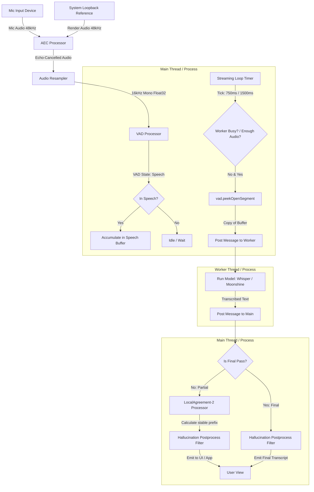
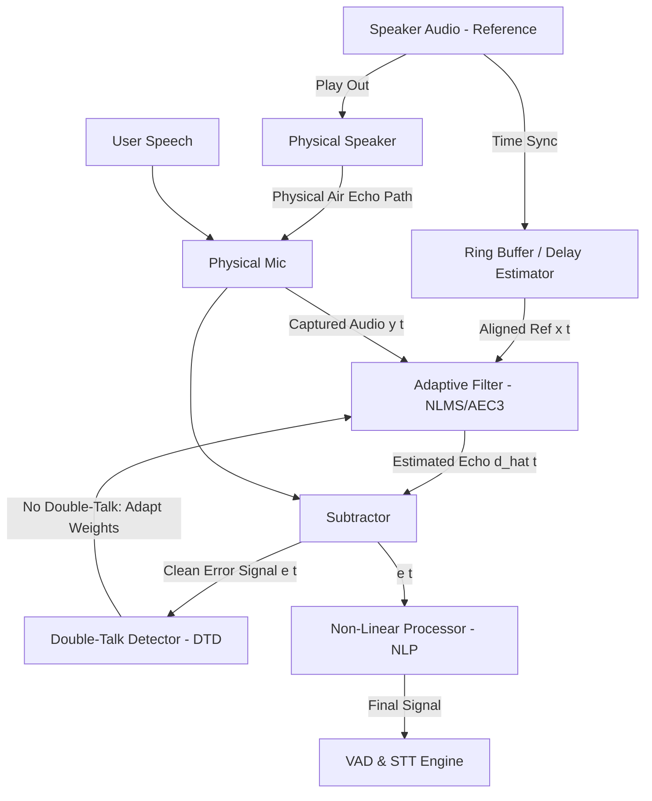

# Low-Latency, Hallucination-Free STT Architecture Blueprint

This document details the technical architecture for a high-accuracy, low-latency Voice Activity Detection (VAD) and Speech-to-Text (STT) pipeline tailored for local execution on Windows.

---

## 1. System Topology & Data Flow

The system runs a dual-thread/dual-process pipeline to isolate CPU/GPU-intensive model inference from audio acquisition and user interface rendering.



---

## 2. Component Engineering

### Component A: Audio Ingestion & Resampler
* **Ingestion**: Capture audio in 10ms–30ms chunks from the hardware device (typically at 48kHz, stereo/mono, 16-bit PCM).
* **Resampling**: Convert to **16kHz, mono, Float32** (normalized between `[-1.0, 1.0]`). Whisper and Moonshine are trained strictly on 16kHz mono audio. 

---

### Component B: Energy-based VAD State Machine
Rather than using heavy neural network-based VAD (like Silero VAD) which adds execution latency and CPU overhead, the architecture uses a lightweight **RMS Energy-based VAD**.

#### Key Math:
$$RMS = \sqrt{\frac{1}{N} \sum_{i=1}^{N} x_i^2}$$

#### State Configuration Parameters:
* **Window Size ($W$)**: 30ms (480 samples at 16kHz).
* **Energy Threshold ($T_{rms}$)**: `0.008` (can be tuned depending on mic sensitivity).
* **Min Speech Duration ($M$)**: `4 frames (~120ms)` to filter out mouth clicks or keyboard noise.
* **Hangover Frames ($H$)**: `10 frames (~300ms)` to bridge brief natural pauses within a sentence.
* **Max Segment Length ($S_{max}$)**: `14 seconds (14000ms)` to prevent memory overflow and keep encoder context windows high-speed.

#### State Transition Logic:
1. **Idle $\rightarrow$ Speech**: When $RMS \ge T_{rms}$ for $\ge M$ consecutive frames.
2. **Speech $\rightarrow$ Hangover**: When $RMS < T_{rms}$, decrement the hangover counter on each frame.
3. **Hangover $\rightarrow$ Speech**: If $RMS \ge T_{rms}$ before the hangover counter reaches `0`.
4. **Hangover $\rightarrow$ Idle (Flush)**: When the hangover counter hits `0`. Emit the accumulated buffer as a **Final Segment**.
5. **Soft Commit (Overlap Context)**: If speech duration hits $S_{max}$, flush the current buffer as a Final Segment, but **do not reset to Idle**. Instead, slice the last **300ms** of audio and prepend it to the new segment buffer. This acts as acoustic conditioning so the next segment doesn't lose the first few spoken words.

---

### Component C: Speculative Streaming Inference Loop
This loop runs continuously on the main thread and polls the open VAD buffer.

1. **Periodic Ticking**: Set a self-scheduling timer (e.g. using `setTimeout` in Node, or an async loop in Python/C#).
   * Moonshine: **750ms**
   * Whisper: **1500ms**
2. **Worker Guards**:
   * Skip the tick if the VAD is not in a speech segment (`!isInSpeech`).
   * Skip the tick if a prior inference task is still running (`taskInFlight = true`).
   * Skip the tick if the active buffer has less than $T_{min}$ audio (`durationMs < 400ms` for Moonshine, `800ms` for Whisper).
3. **Speculative Slicing (`peekOpenSegment`)**: Copy the audio currently inside the VAD buffer without clearing or closing it. Pass this buffer copy to the background thread.
4. **Worker Backoff**: If the worker fails to respond quickly and 3 ticks are skipped due to a busy worker, double the poll delay (up to `12000ms`) to prevent thread lock, resetting to the base interval upon a successful response.

---

### Component D: LocalAgreement-2 (LA2) Consensus Algorithm
Because the speculative loop runs on an expanding buffer, the end of the text will "flicker" as the model attempts to fit expanding context. LA2 filters out this noise:

```
Step 1: Receive transcript text T_new from speculative pass.
Step 2: Apply Hallucination Postprocessing Filter -> T_cleaned.
Step 3: If T_last is empty (first pass of segment):
            T_last = T_cleaned
            Return (Emit nothing)
Step 4: Find T_agreed = Longest Common Prefix (T_last, T_cleaned).
Step 5: T_last = T_cleaned.
Step 6: If T_agreed ends inside a word:
            Roll T_agreed back to the last whitespace boundary.
Step 7: If length(T_agreed) > length(T_emitted):
            T_new_words = T_agreed.substring(length(T_emitted))
            T_emitted = T_agreed
            Emit T_new_words to the UI / Application
```

#### Visualizing the agreement over ticks:
* **Tick 1 (Audio: 1.5s)**: Model returns `"hello how are"` $\rightarrow$ Store as `T_last`, emit nothing.
* **Tick 2 (Audio: 3.0s)**: Model returns `"hello how old are you"` $\rightarrow$ LCP is `"hello how "` $\rightarrow$ Snap to whitespace: `"hello how "` $\rightarrow$ Emit `"hello how "` (`T_emitted`).
* **Tick 3 (Audio: 4.5s)**: Model returns `"hello how old are you today"` $\rightarrow$ LCP against Tick 2 is `"hello how old are you "` $\rightarrow$ Snap to whitespace: `"hello how old are you "` $\rightarrow$ Emit `"old are you "` (difference from `T_emitted`).

---

### Component E: Anti-Hallucination Measures
Whisper models will hallucinate loops, background sounds, or subtitles on silence or near-silence. You must configure both your model generation settings and apply postprocessing:

#### 1. Generation Parameters (Inference Engine)
* **`condition_on_previous_text = false`**: Force the model to evaluate the audio chunk in isolation. If true, a hallucination in the first 5 seconds will propagate across the entire 15-minute conversation.
* **`temperature = 0.0`**: Forces greedy decoding (deterministic results). Do not use temperature search/sampling for real-time STT.
* **`compression_ratio_threshold = 2.4`**: If the gzip compression ratio of the token output is high, the model is stuck in a repetition loop (e.g. *"thank you. thank you. thank you..."*). Discard the result.
* **`no_speech_threshold = 0.6`**: If the probability of no-speech exceeds 60%, discard the tokens.

#### 2. Postprocessing Text Filters
Discard transcripts entirely if they match any of the following:
* **Short strings**: If trimmed length $< 2$ characters.
* **Hallucination Blacklist**: Case-insensitive matches for:
  * `[music]`, `[applause]`, `[inaudible]`, `(music)`, `(applause)`, `(laughter)`
  * `thank you for watching`, `thanks for watching`, `you`, `bye`, `...`, `.`
* **Tag filtering**: Any string matching the regular expression `/^\[.*\]$/` (like `[BLANK_AUDIO]` or `[LAUGHTER]`).

---

## 3. Acoustic Echo Cancellation (AEC) Architecture

When performing real-time local STT, system audio (e.g. text-to-speech feedback, system alerts, or remote callers) played over speakers gets captured by the microphone. This causes the STT engine to transcribe the system's own output, leading to loops, echo duplication, and hallucinations. 

Acoustic Echo Cancellation (AEC) removes this speaker feedback from the microphone signal before it enters the VAD processor.

### AEC Core Components & DSP Pipeline



1. **Signal Definitions**:
   * **Reference Signal ($x(t)$)**: The loopback system audio sent to the speaker output.
   * **Primary Signal ($y(t)$)**: The microphone capture containing User Voice ($s(t)$) + Acoustic Echo ($d(t)$) + Ambient Noise ($v(t)$).
   * **Error Signal ($e(t)$)**: The filtered output: $e(t) = y(t) - \hat{d}(t)$, where $\hat{d}(t)$ is the estimated echo.
2. **Adaptive Filtering**:
   * Implemented using a Normalized Least Mean Squares (NLMS) or Block Frequency Domain Adaptive Filter (FDAF). 
   * The filter models the acoustic echo path (reflections from walls/room) and subtracts it.
3. **Time Alignment (Delay Estimation)**:
   * The reference speaker audio must match the captured microphone audio sample-for-sample.
   * Since sound cards have playout latency, write both capture and reference loopback signals to sync buffers. Match them using cross-correlation or tracking ring-buffer positions.
4. **Double-Talk Detection (DTD)**:
   * When both the user and the system speak at the same time, the adaptive filter's weights will diverge (it tries to cancel the user's voice, causing distortion).
   * DTD monitors signal cross-correlation. If double-talk is detected, weight adaptation is **frozen** to lock the current filter coefficients until the user stops.
5. **Non-Linear Processor (NLP) & Post-Filter**:
   * Adaptive filters cannot clean $100\%$ of echo due to speaker enclosure distortions or physical clipping. 
   * NLP performs spectral suppression, finding remaining residual echo in specific frequency bands and attenuating them.

---

## 4. Windows-Specific Optimizations & Implementations

### Windows Echo Cancellation Implementation Options

On Windows, you can implement AEC using native OS features or open-source DSP libraries:

1. **Windows Voice Capture DSP (WASAPI - Recommended)**:
   * The Windows Core Audio APIs (WASAPI) provide a built-in Voice Capture DSP that implements system-level AEC.
   * By initializing WASAPI in **Speech/Voice Communication Mode** (using `AUDCLNT_STREAMFLAGS_EVENTCALLBACK` + activating the `VoiceCapture` effect via DirectShow/Media Foundation), Windows will automatically capture the speaker loopback, perform time alignment, DTD, and spectral subtraction at the kernel level.
   * This offloads DSP computation to the OS/Audio driver, minimizing CPU cycles and eliminating the need to bundle third-party C++ libraries.
2. **WebRTC AEC3 / APM Integration**:
   * Integrate Google's WebRTC Audio Processing Module (APM).
   * Pass 10ms chunks of Microphone Capture (Near-End) and Speaker Loopback (Far-End / Reference) into the WebRTC APM instance. 
   * WebRTC AEC3 handles delay estimation, NLMS filtering, DTD, and noise suppression internally.

### Pipeline Tuning for STT

* **Buffer Tuning**: Keep buffer frames small (10ms to 20ms chunks) to prevent the delay estimator from losing tracking sync.
* **Hardware Acceleration (Inference)**:
   * Use **ONNX Runtime (ORT)** with the **DirectML (DML) Execution Provider** for Windows local GPU execution.
   * Alternatively, target **CUDA** if running on NVIDIA hardware.
* **Quantization Setup (Whisper-Safe Dtype)**:
   * Keep the **Encoder** model in **FP32** format. Quantizing Whisper's encoder to INT8 or FP16 often results in acoustic accuracy degradation and raises the hallucination rate.
   * Quantize the **Decoder** models to **Q8 / INT8** for $90\%$ of inference speedup.
* **Process/Thread Isolation**:
   * In C# / C++, run audio capture, AEC, and VAD on the main thread, and call the STT engine asynchronously via tasks or thread pool.
   * In Node.js / Electron, run the inference inside a dedicated worker thread (`worker_threads` module) and transfer the Float32 audio buffers using `SharedArrayBuffer` or Transferable Objects.
   * In Python, run inference in a subprocess (`multiprocessing` or a FastAPI server process) to bypass Python's Global Interpreter Lock (GIL) and prevent capture frame drops.
